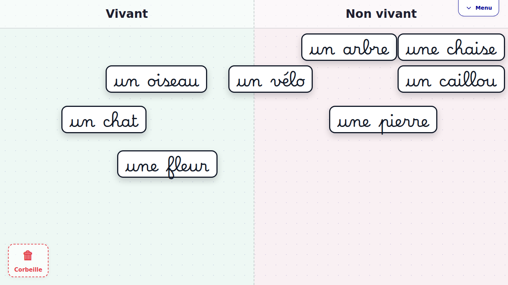
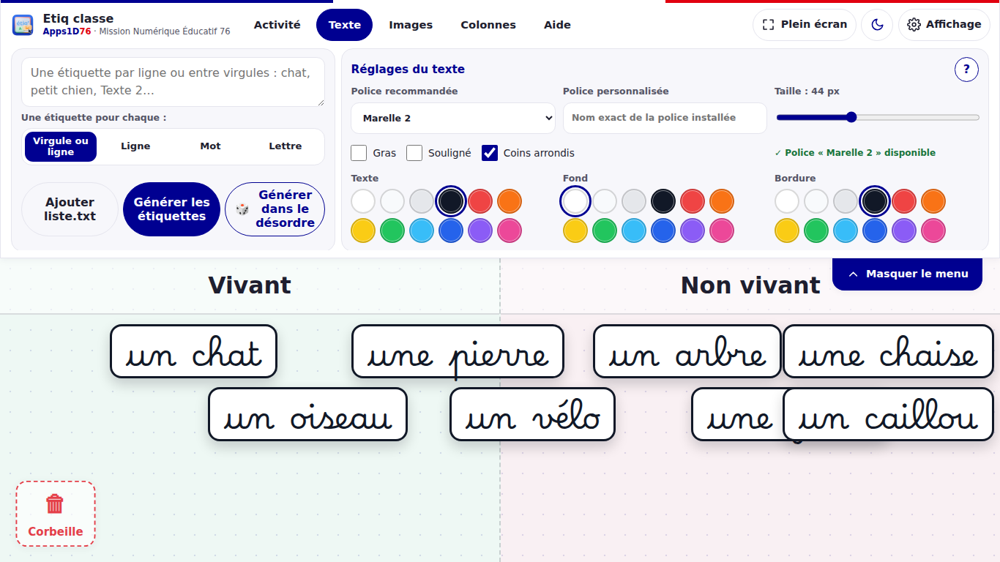

# Etiq classe

**Générateur d'étiquettes déplaçables (texte et image) pour le tableau numérique.**

Etiq classe permet de créer en quelques secondes des étiquettes à manipuler au TNI / VPI : mots à trier, images à classer, phrases à remettre dans l'ordre, catégorisation dans des colonnes (Oui / Non, Vrai / Faux, colonnes personnalisées). Les étiquettes se déplacent à la souris, au doigt ou au stylet, et une activité se sauvegarde dans un seul fichier `.etiq` facile à partager.



## Public visé

- **Niveau :** école maternelle et élémentaire (cycles 1 à 3), utilisable au-delà.
- **Discipline :** transversal — lecture, vocabulaire, tri et catégorisation, sciences, mathématiques (classement de nombres), langues.
- **Usage :** en classe entière au tableau numérique (TNI, VPI, écran tactile) ou en atelier sur ordinateur ou tablette.

## Utilisation

- **En ligne :** ouvrir le site publié par GitLab Pages (lien dans la description du projet sur la Forge).
- **Hors ligne :** télécharger le projet, puis ouvrir `index.html` dans un navigateur. Aucune installation n'est nécessaire.
- **Activité d'exemple :** onglet *Activité* > *Ouvrir .etiq* > `exemples/exemple-tri-vivant-non-vivant.etiq`.



### En bref

1. Onglet **Texte** : saisir les mots, choisir le découpage (*une étiquette pour chaque virgule ou ligne*, ligne, mot ou lettre), puis **Générer les étiquettes** (dans l'ordre ou dans le désordre).
2. Onglet **Images** : ajouter une ou plusieurs images ; la poignée ronde redimensionne une image.
3. Onglet **Colonnes** : ajouter des colonnes de tri en fond de plateau.
4. Déplacer les étiquettes ; les glisser dans la **corbeille** pour les supprimer.
5. La languette **Masquer le menu** libère tout le plateau ; **Plein écran** est conseillé au TNI.
6. Onglet **Activité** : enregistrer ou ouvrir une activité `.etiq`.

## Fonctionnalités

- Découpage du texte par virgule ou ligne (par défaut), par ligne, par mot ou par lettre, avec aperçu avant génération ; une virgule entre deux chiffres (1,5) ne coupe pas.
- Génération dans l'ordre ou dans le désordre, import d'une liste `.txt`.
- Polices adaptées à l'école intégrées : Marelle 2 (cursive), Marelle Baton 2, OpenDyslexic ; Arial, Century Gothic, Comic Sans MS ou toute police installée.
- Taille, gras, souligné, couleurs du texte, du fond et de la bordure.
- Plusieurs images d'un coup, redimensionnables.
- Colonnes rapides (2, 3, 4, Oui / Non, Vrai / Faux) et personnalisées.
- Déplacement à plusieurs en même temps sur écran tactile.
- Menu masquable, positionnable en haut, en bas, à gauche ou à droite.
- Paramètres d'affichage communs aux outils Apps1D76 : thème clair / sombre, taille du texte, animations, contraste renforcé.
- Sauvegarde automatique dans le navigateur et fichiers `.etiq`.

## Prérequis techniques

- Un navigateur récent : Firefox, Chrome, Edge ou Safari (versions de 2023 ou plus récentes).
- Aucun serveur, aucun compte, aucune installation. Fonctionne hors connexion.
- Seule la police d'interface Marianne est chargée depuis Internet (CDN jsdelivr) ; sans connexion, une police du système la remplace automatiquement.

## Format des fichiers `.etiq`

Un fichier `.etiq` est un fichier texte au format JSON qui contient les étiquettes (texte, position, taille, style), les images intégrées (en base64), les colonnes et la position du menu. Un seul fichier suffit pour déplacer, copier ou partager une activité.

## Données personnelles

Etiq classe n'envoie aucune donnée sur Internet et ne collecte rien. Les activités restent dans le navigateur (sauvegarde automatique) et dans les fichiers `.etiq` que vous enregistrez. Les images ajoutées sont intégrées dans le fichier `.etiq` : avant de partager une activité, vérifiez qu'elle ne contient ni photo ni nom d'élève.

## Licences et auteurs

- **Auteur :** Liaudet Etienne, Mission Numérique Éducatif 76.
- **Code** (HTML, CSS, JavaScript) : licence [MIT](LICENSE).
- **Contenus** (textes d'aide, documentation, icône, activité d'exemple, captures d'écran) : licence [Creative Commons Attribution 4.0 (CC BY 4.0)](https://creativecommons.org/licenses/by/4.0/deed.fr).
- Les activités que vous créez avec Etiq classe vous appartiennent.

### Ressources tierces

| Ressource | Auteur | Licence | Lien |
|---|---|---|---|
| Polices Marelle 2 et Marelle Baton 2 (v1.002) | Ministère de l'Éducation nationale, L. Bourcellier, J. Fabreguettes, R. Wagner | SIL Open Font License 1.1 ([texte](assets/fonts/Marelle-LICENSE.txt)) | [marelle.forge.apps.education.fr](https://marelle.forge.apps.education.fr/) |
| Police OpenDyslexic | Abbie Gonzalez | SIL Open Font License 1.1 ([texte](assets/fonts/OpenDyslexic-LICENSE.txt)) | [opendyslexic.org](https://opendyslexic.org/) |
| Police d'interface Marianne | État français (Système de design de l'État) | Usage réservé aux services de l'État ; non incluse dans le dépôt, chargée depuis le DSFR | [systeme-de-design.gouv.fr](https://www.systeme-de-design.gouv.fr/) |
| Icônes lune, soleil et roue crantée (dérivées) | Cole Bemis, Feather Icons | MIT | [feathericons.com](https://feathericons.com) |

> **Réutilisation hors des services de l'État :** la police Marianne n'est pas libre. Pour une version dérivée diffusée en dehors de l'Éducation nationale, supprimez les deux règles `@font-face` Marianne au début de `styles/style.css` : l'interface utilisera alors la police du système.

## Structure du dépôt

```
index.html           page de l'application
scripts/app.js       logique (étiquettes, colonnes, sauvegarde, préférences)
styles/style.css     mise en forme
assets/icon.png      icône
assets/fonts/        polices Marelle et OpenDyslexic + leurs licences
exemples/            activité d'exemple au format .etiq
images/              captures d'écran du README
.gitlab-ci.yml       publication sur GitLab Pages
```

## Contribuer

Les retours d'enseignants sont précieux : bugs, idées, nouvelles activités d'exemple. Voir [CONTRIBUTING.md](CONTRIBUTING.md) pour ouvrir un ticket ou proposer une demande de fusion. L'historique des versions est dans [CHANGELOG.md](CHANGELOG.md).

**Contributions attendues :** tests sur différents modèles de TNI / VPI, activités d'exemple par discipline, traductions, amélioration de l'accessibilité.

## Problèmes connus

- **Sauvegarde automatique limitée :** le navigateur limite la place disponible (quelques Mo). Avec beaucoup d'images, un message prévient que la sauvegarde automatique a échoué : enregistrez alors l'activité en `.etiq`.
- **Century Gothic et Comic Sans MS** dépendent des polices installées sur l'ordinateur ; un message sous la liste des polices indique si elles sont disponibles, sinon Arial est utilisée.
- **Petits écrans (hauteur 768 px) :** certains onglets du menu nécessitent un léger défilement ; la languette permet de masquer le menu pendant l'activité.
- **Tablettes et TNI :** testé en simulation tactile ; les retours sur matériel réel sont bienvenus.
